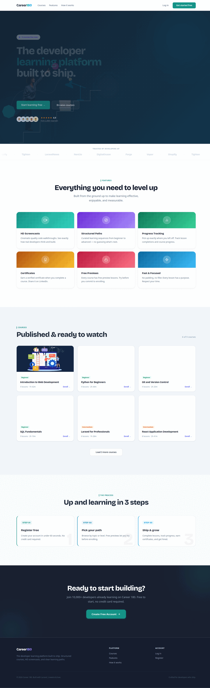
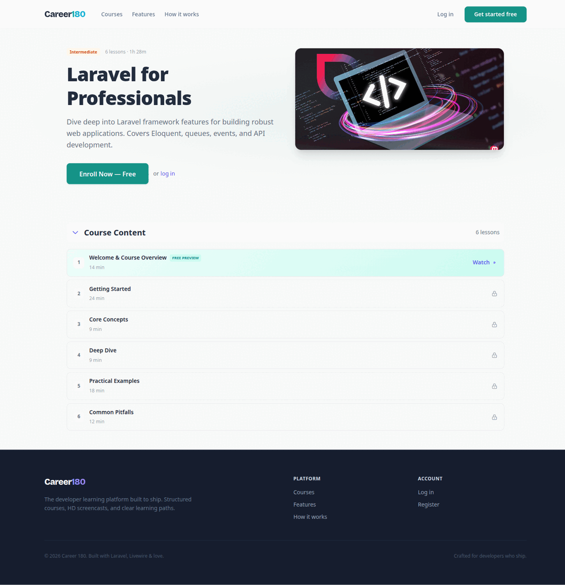
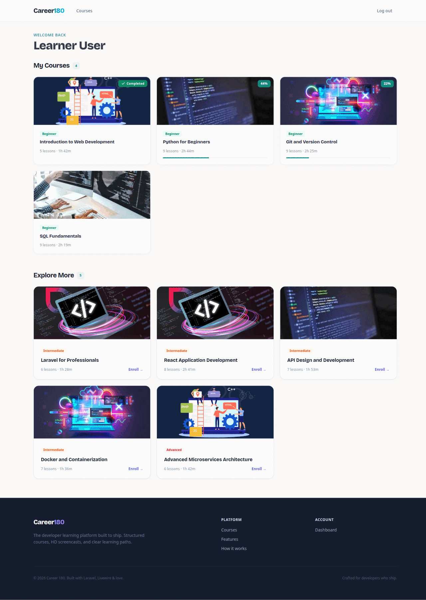
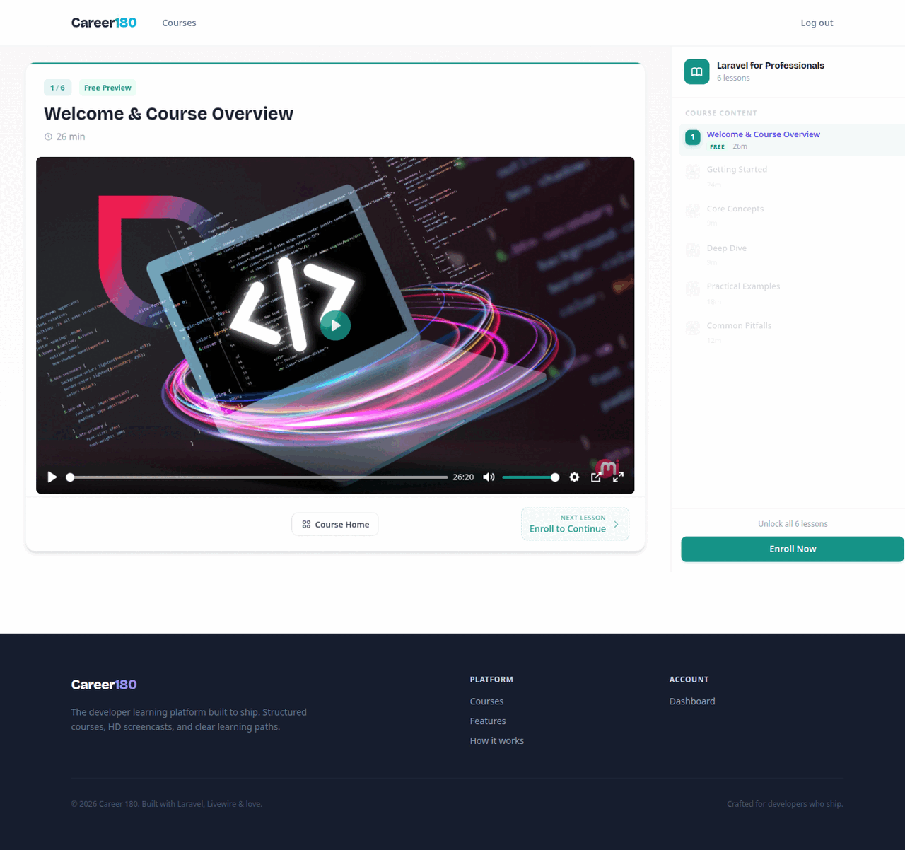
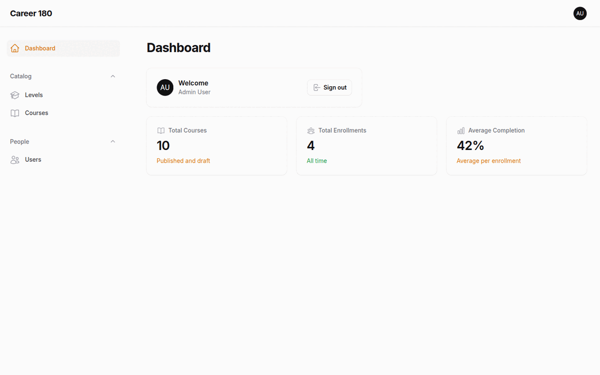
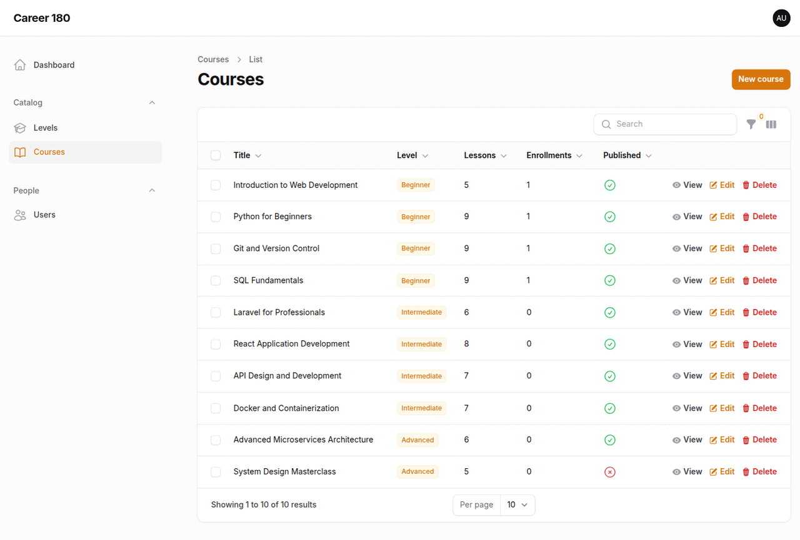

# Career 180 — LMS

**A production-style Learning Management System where developers learn by shipping.**
Public course catalog, free-preview lessons, real video playback, enrollment and progress tracking, automatic completion emails, and a full admin panel — built with Laravel 12, Livewire 3, Filament 3 and Tailwind CSS 4.

[](https://github.com/Moustafa-Ahmed/lms/actions/workflows/ci.yml)
[](https://laravel.com)
[](https://www.php.net)
[](https://livewire.laravel.com)
[](https://filamentphp.com)
[](https://tailwindcss.com)
[](https://pestphp.com)
[](LICENSE)



---

## Overview

Career 180 is a complete learning platform with two audiences and one shared domain:

- **Learners** browse a public catalog, preview the first lesson of every course for free, enroll, watch video lessons, track their progress, and receive an email the moment they complete a course.
- **Administrators** manage levels, courses, lessons, users and enrollments from a Filament panel, with relation managers, soft-delete restore, media uploads and an at-a-glance stats dashboard.

It is deliberately built the way a real product would be: business rules live in testable action classes, authorization is policy-driven, writes are transactional and idempotent, and the whole thing is covered by an automated test suite and CI.

---

## Features

### Learner experience
- **Public catalog** with Livewire-powered "load more" pagination and level badges.
- **Free preview** — the first lesson of every course is open to guests; the rest unlock on enrollment.
- **Enrollment** with a one-click Livewire button, safe against double submissions.
- **Video lessons** played through a custom [Plyr](https://plyr.io) integration, with next/previous navigation and a lesson sidebar.
- **Progress tracking** — per-lesson completion plus watch-time tracking that never regresses.
- **Course completion** — finishing every lesson records a completion and sends an email (queued, exactly once).
- **Timezone-aware UI** — the browser timezone is synced to the session and used to render dates.
- **Accounts** — registration, email verification, password reset and **two-factor authentication** (Laravel Fortify).

### Admin experience (Filament)
- Resources for **Levels, Courses, Lessons, Users and Enrollments**.
- **Relation managers** for a course's lessons and enrollments, and a user's enrollments.
- **Media uploads** for course images and lesson video/thumbnails (Spatie Media Library).
- **Soft-delete restore**, filters (level, published, trashed) and slug auto-generation.
- **Stats widget** showing total courses, enrollments and average completion.

---

## Screenshots

| Course detail | Learner dashboard |
| --- | --- |
|  |  |

**Lesson player** — Plyr video, progress and next-lesson navigation:



| Admin dashboard | Admin course management |
| --- | --- |
|  |  |

---

## Tech stack

| Layer | Choice |
| --- | --- |
| Framework | Laravel 12 (PHP 8.3+) |
| Interactive UI | Livewire 3 + Alpine.js |
| Design system | Tailwind CSS 4 + Flux UI (free) |
| Admin panel | Filament 3 |
| Auth | Laravel Fortify (incl. 2FA) |
| Media | Spatie Laravel Media Library |
| Database | SQLite (default) · MySQL 8 (via Laravel Sail) |
| Asset bundling | Vite 7 |
| Tests | Pest 4 |
| Code style | Laravel Pint |

---

## Architecture

Requests flow through thin controllers and Livewire components into **single-purpose action classes**; models own relationships and query scopes, and policies own authorization.

```
HTTP / Livewire  ──▶  Actions (app/Actions)  ──▶  Eloquent models
      │                      │
      ▼                      ▼
  Policies            Events / Observers ──▶ Queued mail
```

- `app/Actions` — every meaningful write (`EnrollInCourseAction`, `CompleteLessonAction`, `TrackWatchTimeAction`, `FinalizeCourseCompletionAction`, …) is a dedicated, injectable class.
- `app/Policies` — `LessonPolicy` gates lesson access (free preview **or** enrolled); `CoursePolicy` gates enrollment.
- `app/Observers` — keep derived course stats in sync when lessons change.
- `app/Filament` — the admin panel is a first-class part of the app, not an afterthought.

The full domain model is documented as an ER diagram ([`docs/ER Diagram.png`](docs/ER%20Diagram.png)) and in [`docs/architecture.md`](docs/architecture.md).

### Engineering highlights

1. **Action-oriented domain layer.** All writes go through small, injectable classes, so business rules are unit-testable and reusable from HTTP, Livewire and the console. Controllers and components stay thin.
2. **Concurrency-safe, idempotent writes.** Enrollment and completion lean on database **unique constraints**; the actions catch `UniqueConstraintViolationException` and return the existing record. Double-clicks and race conditions can't create duplicates or 500s.
3. **Transactional completion with deferred side effects.** `CompleteLessonAction` records the lesson and finalizes the course inside a transaction, then registers the completion email with `DB::afterCommit(...)` — the email is sent **exactly once**, and only if the transaction actually commits.
4. **Policy-based authorization + isolation tests.** Feature tests assert that a learner can never view or complete another user's lessons or progress.
5. **Media with mime-type restrictions.** Course images and lesson video/thumbnails are managed as Spatie Media Library collections.
6. **Timezone-aware timestamps.** A small `UserTimezone` support class normalizes the browser zone (synced via Livewire) and the admin panel renders dates in the viewer's timezone.
7. **Tested and linted in CI.** 106 Pest tests and Laravel Pint run on PHP 8.3 and 8.4 for every pull request.
8. **Kept current.** `composer audit` and `npm audit` both report **zero known advisories**, and the lockfile is resolved against the minimum supported PHP (8.3) so it installs cleanly across the whole CI matrix.

---

## Getting started

### Prerequisites
- PHP **8.3+** with the usual extensions
- [Composer](https://getcomposer.org) 2
- Node.js **20+** and npm
- **Optional:** [Docker](https://www.docker.com) to run the stack with Laravel Sail
- **Optional:** MySQL 8 — the app defaults to SQLite, so no database server is required

### Quick start (SQLite — no services)

```bash
git clone https://github.com/Moustafa-Ahmed/lms.git
cd lms
composer setup   # installs PHP/JS deps, creates .env, generates a key, builds assets, links storage, migrates
php artisan db:seed
```

The committed `.env.example` defaults to SQLite, so this runs with nothing else installed. Start the app (server + queue worker + Vite):

```bash
composer run dev
```

<details>
<summary><strong>Docker with Laravel Sail (MySQL 8)</strong></summary>

A [`compose.yaml`](compose.yaml) ships with the project. Uncomment the MySQL block in `.env`, then run the stack in containers:

```bash
composer install
cp .env.example .env          # then uncomment the MySQL block
./vendor/bin/sail up -d
./vendor/bin/sail artisan key:generate
./vendor/bin/sail artisan migrate --seed
./vendor/bin/sail npm install && ./vendor/bin/sail npm run build
```

Sail serves the app on <http://localhost> and forwards Vite on port 5173 (`./vendor/bin/sail npm run dev`).

</details>

### Demo credentials

| Role | Email | Password | Where |
| --- | --- | --- | --- |
| Admin | `admin@example.com` | `password` | `/admin` |
| Learner | `learner@example.com` | `password` | `/login` |

The seeder creates **10 courses** (9 published + 1 draft), **5–10 lessons** per course with the first lesson free to preview, and enrolls the demo learner in 4 courses with progress and one completed course — so the dashboard, progress badges and completion email all have something to show immediately. The bundled demo video is attached to the first (free-preview) lesson of each course; set `SEED_DEMO_VIDEO=false` in `.env` to skip it and keep seeding fast.

---

## Testing

```bash
composer test                 # config:clear + Pint + Pest
php artisan test --compact    # Pest only
php artisan test --compact --filter=LessonProgress
```

The suite covers the action layer, policies, database constraints, idempotency, Fortify authentication flows (including 2FA) and Filament access.

> Error pages reference Vite, so build the front-end once (`npm run build`, or `composer setup`) before running the tests locally. CI does this automatically.

<details>
<summary>Run the suite against MySQL 8 (Sail)</summary>

The default suite runs on in-memory SQLite for speed. To run the exact same suite on MySQL, use the `testing` database that Sail provisions automatically:

```bash
./vendor/bin/sail up -d

./vendor/bin/sail exec -T -u sail \
  -e DB_CONNECTION=mysql -e DB_HOST=mysql -e DB_PORT=3306 \
  -e DB_DATABASE=testing -e DB_USERNAME=sail -e DB_PASSWORD=password \
  laravel.test php artisan test --compact
```

</details>

---

## Project structure

```
app/
├── Actions/        # single-purpose domain actions (Course, Lesson, Dashboard, Fortify)
├── Filament/       # admin resources, relation managers and widgets
├── Http/           # thin controllers + form requests
├── Livewire/       # catalog, enrollment, lesson navigation, dashboard, settings
├── Models/         # Course, Lesson, Level, Enrollment, LessonProgress, CourseCompletion, User
├── Policies/       # CoursePolicy, LessonPolicy
└── Support/        # UserTimezone, etc.
database/seeders/   # Levels, Users, Courses, Lessons, Enrollments, Progress, Completions
resources/          # Blade views, Livewire views, CSS/JS, demo media
docs/               # architecture notes, ER diagram, screenshots
tests/              # Pest feature + unit tests
```

---

## Roadmap

- [ ] Hosted live demo
- [ ] Course search and filtering in the catalog
- [ ] Certificates and course ratings/reviews
- [ ] Move demo media to object storage (see note below)

> **Note on demo media.** For a fully working demo out of the box, the seeder attaches a single committed sample video (`resources/demo/videos/demo.mp4`, ~49 MB) to the first lesson of each course. In a real deployment, lesson video would live in object storage (S3) rather than the repository, and `SEED_DEMO_VIDEO=false` keeps local seeding light.

---

## License

Released under the [MIT License](LICENSE). © 2026 Moustafa Ahmed.
