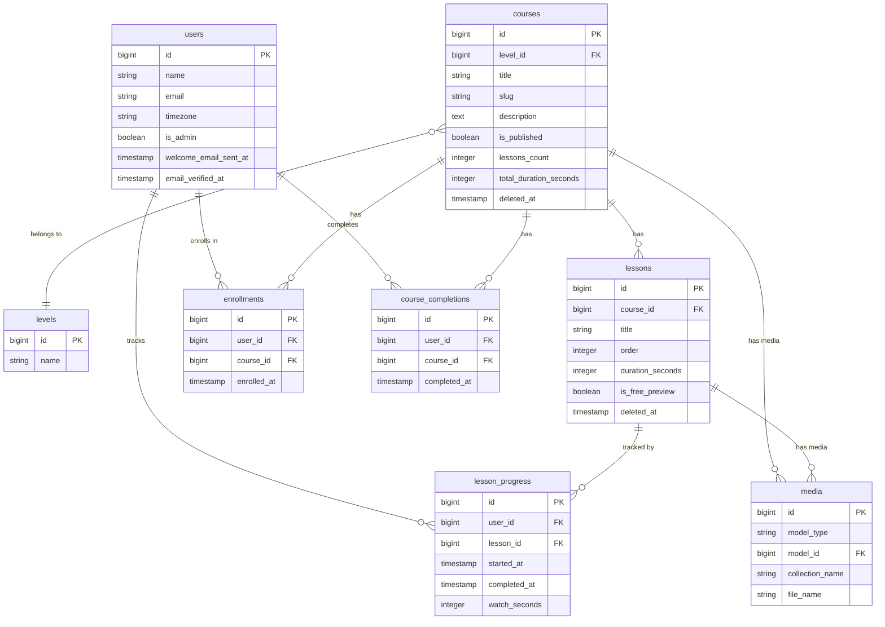

# Career 180 LMS

A mini Learning Management System built with Laravel 12, Livewire 3, Alpine.js, Tailwind CSS v4, Filament v3, and Pest.

## Stack

- **Backend:** Laravel 12, PHP 8.3
- **Frontend:** Livewire 3, Alpine.js, Tailwind CSS v4, Plyr.js
- **Admin:** Filament v3
- **Testing:** Pest v4
- **Queue:** Database driver (configurable)

## Setup

### Requirements

- PHP 8.3+
- Composer
- Node.js 18+
- MySQL 8 or SQLite

### Installation

```bash
git clone <repo-url>
cd lms

# Install PHP dependencies
composer install

# Install Node dependencies
npm install

# Copy environment file
cp .env.example .env

# Generate app key
php artisan key:generate

# Configure your database in .env (DB_CONNECTION, DB_DATABASE, etc.)

# Run migrations and seed the database
php artisan migrate --seed

# Build frontend assets
npm run build
```

### Development

```bash
composer run dev
```

This runs the Laravel dev server, queue worker, and Vite in parallel.

## Seeds

The seeder creates the following data:

| Type            | Details                                           |
| --------------- | ------------------------------------------------- |
| Admin user      | `admin@example.com` / `password`                  |
| Learner user    | `learner@example.com` / `password`                |
| Levels          | Beginner, Intermediate, Advanced                  |
| Courses         | 10 published courses (1 draft), 5–10 lessons each |
| Preview lessons | First lesson of every course is a free preview    |

## Running Tests

```bash
php artisan test
```

Run a specific test file or filter:

```bash
php artisan test tests/Feature/Course/CatalogAndEnrollmentTest.php
php artisan test --filter="registration sends welcome email"
```

## Assumptions & Limitations

- Video content is managed via Spatie MediaLibrary (file uploads) rather than plain URL strings. The `video_url` accessor returns the first uploaded media URL, falling back to an empty string.
- The queue driver defaults to `database`; a running `php artisan queue:work` process is required for welcome and completion emails to be delivered.
- User timezone preference defaults to `UTC`; timestamps are stored in UTC and displayed in the user's timezone we get using request to the backend that updates the user timezone .
- Soft-deleted courses retain their slug in the uniqueness check — a new course cannot claim a slug that belongs to a trashed course until the trashed course is force-deleted.
- The Filament admin panel is restricted to users with `is_admin = true`.

## If I Had More Time…

- do a proper test base class with common setup and helper methods for authentication, course creation, enrollment, etc.
- clean up the UI and add more visual polish (e.g. better mobile responsiveness, loading states, empty states, etc.)
- reduce the number of database queries as much as possible.
- add caching strategies for expensive queries .
- Implement a certificate PDF generated on course completion using a queued job.
- add a user profile page with editable name/email and a list of completed courses with certificates.
- Add course search and filtering (by level, tag, duration) on the home page.
- Introduce course ratings and reviews and comments on each lesson and course.
- better reporting for stats in admin panel.

## Test Screenshot

_(Add a screenshot of all passing tests here)_

## Database ERD


